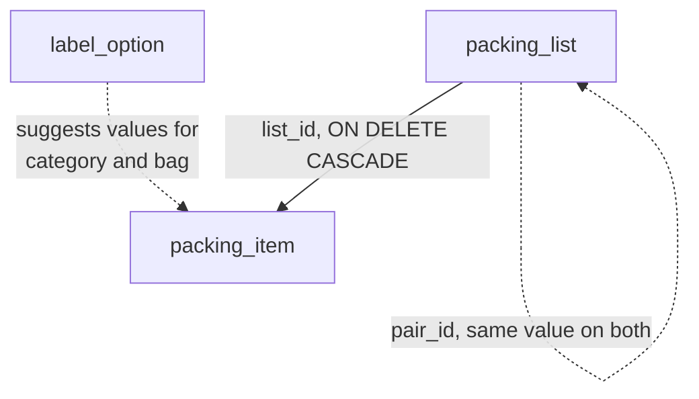

# Data model

Last verified: 2026-09-19

**What this is for.** Every table this application ships, what each column
means, and which rules the database itself enforces. The vocabularies the
enumerated columns draw on live in `app/constants.py` and are not repeated
here; why the shape is what it is lives in `notes/decisions.md`.

The authority is `alembic/versions/`. If a row here and a migration disagree,
the migration wins and this page is wrong.

## Table of contents

- [`packing_list`](#packing_list) — a named set of things to pack
- [`packing_item`](#packing_item) — one line on a list
- [`label_option`](#label_option) — remembered values for the free-text fields

## The shape

Two of the three edges are dotted because they are not foreign keys. A
round-trip pair is two `packing_list` rows sharing a `pair_id` value, and an
item's `category` and `bag` are free text that `label_option` merely suggests.
Neither is enforced, and both are deliberate — see `notes/decisions.md`.

There is no trip table. A list carries its own `departure_at`.

## `packing_list`

A list is one entity; two independent flags decide what kind it is. `saved`
exempts it from the three-slot cap, `template` offers it as a starting point
when creating a new list. A list can be both, either or neither.

| Column | Type | Null | Default | Notes |
| --- | --- | --- | --- | --- |
| `id` | integer | no | identity | |
| `name` | text | no | | |
| `departure_at` | date | **yes** | | What makes packing timing mean anything. Null is normal — the list still works, nothing is ever "due now". |
| `saved` | boolean | no | `false` | Exempt from the cap. |
| `template` | boolean | no | `false` | Offered when creating a list. |
| `leg` | text | yes | | `outbound` or `return`, or null for a list that is neither. |
| `pair_id` | text | yes | | Shared by the two lists of a round trip. Indexed. |
| `visibility` | text | no | `private` | `private`, `unlisted`, `public`. **Nothing reads this yet.** |
| `created_at` | timestamptz | no | `now()` | Orders the cap's eviction. |
| `updated_at` | timestamptz | no | `now()` | |

**Constraints**

| Name | What it enforces |
| --- | --- |
| `ck_packing_list_leg` | `leg IS NULL OR leg IN ('outbound', 'return')` — both arms matter: `leg IN (...)` is NULL rather than TRUE for a null column, so a constraint written without the null arm would still permit null, by accident rather than by intent. |
| `ck_packing_list_visibility` | One of the three values. |

## `packing_item`

| Column | Type | Null | Default | Notes |
| --- | --- | --- | --- | --- |
| `id` | integer | no | identity | |
| `list_id` | integer | no | | FK to `packing_list.id`, `ON DELETE CASCADE`. Indexed. |
| `name` | text | no | | |
| `category` | text | yes | | Free text. `label_option` suggests; it does not constrain. |
| `bag` | text | yes | | Free text, same. |
| `quantity` | integer | **yes** | | How many to pack. Null means the question does not apply. |
| `quantity_packed` | integer | no | `0` | How many are in the bag. May exceed `quantity`; over-packing is not an error. |
| `unit` | text | yes | | "pairs", "days' worth". Carries what the number cannot. |
| `status` | text | no | `not_packed` | `not_packed`, `packed`, `no_need`. |
| `timing` | text | no | `whenever` | `whenever`, `night_before`, `day_of`, `just_before`. |
| `needs_double_check` | boolean | no | `false` | This one needs verifying. |
| `double_checked` | boolean | no | `false` | Whether that verification happened. Meaningless unless the flag above is set. |
| `notes` | text | yes | | |
| `position` | integer | no | `0` | Order within its own list. |
| `created_at` | timestamptz | no | `now()` | |
| `updated_at` | timestamptz | no | `now()` | |

**Quantity is a target and a count**, which is what forces the number to be
numeric: "3 of 5 packed" cannot be computed from free text. The count never
sets `status` — see `business-rules.md`.

**Double-check is two columns, not a fourth `status` value.** The state worth
knowing is *packed and still unverified*: the passport is in the bag and nobody
has looked at the expiry date. One mutually-exclusive field cannot say that.

**Constraints**

| Name | What it enforces |
| --- | --- |
| `ck_packing_item_status` | One of the three statuses. |
| `ck_packing_item_timing` | One of the four timings. |
| `fk_packing_item_packing_list` | `ON DELETE CASCADE`. At the database level, not only through the ORM relationship — a `DELETE` run by hand from `psql` must not leave orphans either. |

## `label_option`

A suggestion, not a reference. Items store their `category` and `bag` as text;
these rows exist so a value need not be typed twice, and so a typo can be
pruned.

| Column | Type | Null | Default | Notes |
| --- | --- | --- | --- | --- |
| `id` | integer | no | identity | |
| `kind` | text | no | | `category` or `bag`. Indexed. |
| `value` | text | no | | |
| `position` | integer | no | `0` | Display order within a kind. |
| `created_at` | timestamptz | no | `now()` | |
| `updated_at` | timestamptz | no | `now()` | |

**Constraints**

| Name | What it enforces |
| --- | --- |
| `ck_label_option_kind` | `category` or `bag`. |
| `uq_label_option_kind_value` | Unique on the **pair**, so "day bag" can be both a category and a bag — they are different facts. |

Deleting an option leaves the items using it untouched; renaming one rewrites
them. See `business-rules.md`.
