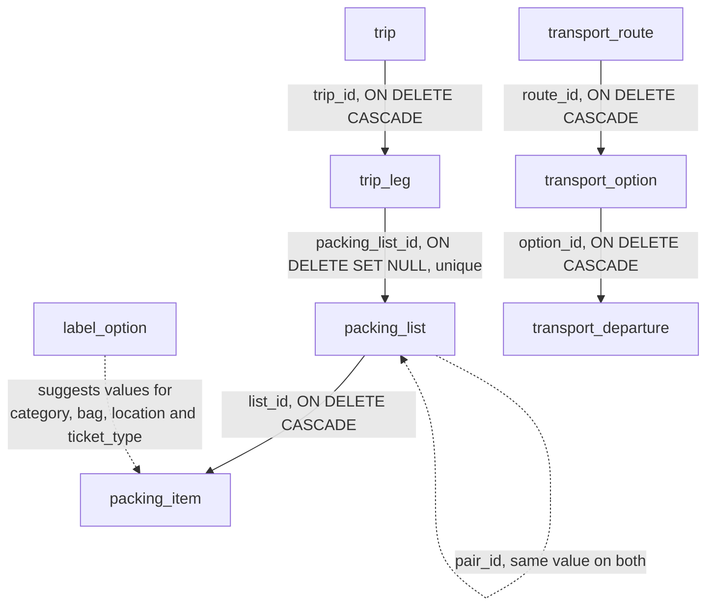

# Data model

Last verified: 2026-10-01

**What this is for.** Every table this application ships, what each column
means, and which rules the database itself enforces. The vocabularies the
enumerated columns draw on live in `app/constants.py` and are not repeated
here; why the shape is what it is lives in `notes/decisions.md`.

The authority is `alembic/versions/`. If a row here and a migration disagree,
the migration wins and this page is wrong.

## Table of contents

- [`packing_list`](#packing_list) — a named set of things to pack
- [`packing_item`](#packing_item) — one line on a list
- [`label_option`](#label_option) — remembered values for the free-text fields
- [`transport_route`](#transport_route) — getting from one place to another
- [`transport_option`](#transport_option) — one way of doing a route
- [`transport_departure`](#transport_departure) — one scheduled time of an option
- [`trip`](#trip) — a named group of journeys
- [`trip_leg`](#trip_leg) — one booked journey, and the list packed for it

## The shape

```mermaid
flowchart TD
    L["packing_list"] -->|list_id, ON DELETE CASCADE| I["packing_item"]
    L -.->|pair_id, same value on both| L
    O["label_option"] -.->|suggests values for<br/>category, bag, location and ticket_type| I
    R["transport_route"] -->|route_id, ON DELETE CASCADE| T["transport_option"]
    T -->|option_id, ON DELETE CASCADE| D["transport_departure"]
    P["trip"] -->|trip_id, ON DELETE CASCADE| G["trip_leg"]
    G -->|packing_list_id, ON DELETE SET NULL, unique| L
```

Solid edges are foreign keys; the two dotted ones are not. A round-trip pair is
two `packing_list` rows sharing a `pair_id` value, and the free-text `category`,
`bag`, `location` and `ticket_type` fields are values that `label_option` merely
suggests. Neither is enforced, and both are deliberate — see `notes/decisions.md`.
`trip_leg` to `packing_list` is a real foreign key, `ON DELETE SET NULL`.

A list's date comes from the leg that links it, when one does: the link is
`trip_leg.packing_list_id`, unique, so a list belongs to at most one leg. The
list's own `departure_at` is used only while no leg links it. See
`business-rules.md`.

## `packing_list`

A list is one entity; `kind` and `usage` decide which shelf it is on —
範本, 保存 or 一般, and a 一般 list whose `usage` is `past` is 自動保存.
Exactly one shelf per list, and the four check constraints below make every
other combination unstorable. The rules are in `business-rules.md`, "Kinds,
usage and 自動保存"; `trip` carries the same three columns and the same
constraints.

| Column | Type | Null | Default | Notes |
| --- | --- | --- | --- | --- |
| `id` | integer | no | identity | |
| `name` | text | no | | |
| `departure_at` | date | **yes** | | What makes packing timing mean anything. Null is normal — the list still works, nothing is ever "due now". Ignored while a trip leg links the list; reads go through the effective date. |
| `kind` | text | no | `free` | `template` (範本), `saved` (保存) or `free` (一般). |
| `usage` | text | yes | `unused` for a free row | 狀態: `in_use`, `upcoming`, `unused` or `past`. Set exactly when `kind` is `free`. |
| `auto_saved_at` | timestamptz | yes | | When the row entered 自動保存; orders that queue. Set exactly when `usage` is `past`. |
| `leg` | text | yes | | `outbound` or `return`, or null for a list that is neither. |
| `pair_id` | text | yes | | Shared by the two lists of a round trip, which then take one 自動保存 slot. Indexed. |
| `notes` | text | yes | | 備註, the planning remark. |
| `archive_note` | text | yes | | 保存備註 — the remark written afterwards, separate from `notes`. Kept whatever the kind. |
| `visibility` | text | no | `private` | `private`, `unlisted`, `public`. **Nothing reads this yet.** |
| `created_at` | timestamptz | no | `now()` | Orders every index shelf but 自動保存, newest first (then highest `id`). Reads carry it; the leg picker shows its Taipei date and orders by it too. |
| `updated_at` | timestamptz | no | `now()` | |

**Constraints**

| Name | What it enforces |
| --- | --- |
| `ck_packing_list_leg` | `leg IS NULL OR leg IN ('outbound', 'return')` — both arms matter: `leg IN (...)` is NULL rather than TRUE for a null column, so a constraint written without the null arm would still permit null, by accident rather than by intent. |
| `ck_packing_list_visibility` | One of the three values. |
| `ck_packing_list_kind` | `kind IN ('template', 'saved', 'free')`. |
| `ck_packing_list_usage` | `usage IS NULL OR usage IN ('in_use', 'upcoming', 'unused', 'past')`. |
| `ck_packing_list_usage_iff_free` | `(kind = 'free') = (usage IS NOT NULL)` — a 一般 row always has a 狀態, and nothing else has one. |
| `ck_packing_list_auto_saved_at_iff_past` | `COALESCE(usage = 'past', false) = (auto_saved_at IS NOT NULL)` — the `COALESCE` matters: for a null `usage` the comparison is NULL, which a check constraint would let through. |

**`usage`'s default is the ORM's, not the database's.** It is `unused` when the
row being inserted is `free` and null otherwise, so a constructor that names
only `kind=template` need not also pass `usage=None` — and a new free row given
an explicit `usage=None` is filled the same way. A raw `INSERT` gets no default,
and an `UPDATE` setting `usage` to null on a free row is refused by
`ck_{table}_usage_iff_free`.

## `packing_item`

| Column | Type | Null | Default | Notes |
| --- | --- | --- | --- | --- |
| `id` | integer | no | identity | |
| `list_id` | integer | no | | FK to `packing_list.id`, `ON DELETE CASCADE`. Indexed. |
| `name` | text | no | | |
| `detail` | text | yes | | A variant (家鑰匙 under 鑰匙) or a description (long c-c beside bed). Items sharing a name are grouped on screen; each is packed on its own. |
| `category` | text | yes | | Free text. `label_option` suggests; it does not constrain. |
| `bag` | text | yes | | Free text, same. |
| `location` | text | yes | | Where the item is taken from or bought. Free text, same. |
| `need` | text | yes | | `need`, `bring` or `buy`. Null means the question does not apply. |
| `quantity` | integer | **yes** | | How many to pack. Null means the question does not apply. |
| `quantity_packed` | integer | no | `0` | How many are in the bag. May exceed `quantity`; over-packing is not an error. |
| `unit` | text | yes | | "pairs", "days' worth". Carries what the number cannot. |
| `status` | text | no | `not_packed` | `not_packed`, `packed`, `no_need`. |
| `timing` | text | no | `whenever` | `whenever`, `night_before`, `day_of`, `just_before`. |
| `needs_double_check` | boolean | no | `false` | This one needs verifying. |
| `double_checked` | boolean | no | `false` | Whether that verification happened. Meaningless unless the flag above is set. |
| `notes` | text | yes | | |
| `position` | integer | no | `0` | Order within its own list. |
| `created_at` | timestamptz | no | `now()` | |
| `updated_at` | timestamptz | no | `now()` | |

**Quantity is a target and a count**, which is what forces the number to be
numeric: "3 of 5 packed" cannot be computed from free text. The count never
sets `status` — see `business-rules.md`.

**Double-check is two columns, not a fourth `status` value.** The state worth
knowing is *packed and still unverified*: the passport is in the bag and nobody
has looked at the expiry date. One mutually-exclusive field cannot say that.

**Constraints**

| Name | What it enforces |
| --- | --- |
| `ck_packing_item_status` | One of the three statuses. |
| `ck_packing_item_timing` | One of the four timings. |
| `ck_packing_item_need` | `need IS NULL OR need IN ('need', 'bring', 'buy')` — the null arm is explicit for the same reason as `ck_packing_list_leg`. |
| `fk_packing_item_packing_list` | `ON DELETE CASCADE`. At the database level, not only through the ORM relationship — a `DELETE` run by hand from `psql` must not leave orphans either. |

## `label_option`

A suggestion, not a reference. Items store their `category`, `bag` and `location`,
and trip legs their `ticket_type`, as text; these rows exist so a value need not be typed twice, and so a typo can be
pruned.

| Column | Type | Null | Default | Notes |
| --- | --- | --- | --- | --- |
| `id` | integer | no | identity | |
| `kind` | text | no | | `category`, `bag`, `location` or `ticket_type`. Indexed. |
| `value` | text | no | | |
| `position` | integer | no | `0` | Display order within a kind. |
| `created_at` | timestamptz | no | `now()` | |
| `updated_at` | timestamptz | no | `now()` | |

**Constraints**

| Name | What it enforces |
| --- | --- |
| `ck_label_option_kind` | `category`, `bag`, `location` or `ticket_type`. |
| `uq_label_option_kind_value` | Unique on the **pair**, so "day bag" can be both a category and a bag — they are different facts. |

Deleting an option leaves the items using it untouched; renaming one rewrites
them. See `business-rules.md`.

## `transport_route`

Getting from one place to another. The places are free text.

| Column | Type | Null | Default | Notes |
| --- | --- | --- | --- | --- |
| `id` | integer | no | identity | |
| `from_place` | text | no | | |
| `to_place` | text | no | | |
| `notes` | text | yes | | |
| `position` | integer | no | `0` | Display order among routes. |
| `created_at` | timestamptz | no | `now()` | |
| `updated_at` | timestamptz | no | `now()` | |

## `transport_option`

One way of doing a route — a bus line, a train service.

| Column | Type | Null | Default | Notes |
| --- | --- | --- | --- | --- |
| `id` | integer | no | identity | |
| `route_id` | integer | no | | FK to `transport_route.id`, `ON DELETE CASCADE`. Indexed. |
| `mode` | text | no | | The line or service name. |
| `advance_ticket` | boolean | no | `false` | A ticket has to be bought ahead. |
| `route_map_url` | text | yes | | |
| `timetable_url` | text | yes | | |
| `live_url` | text | yes | | |
| `direction` | text | yes | | |
| `line_from` | text | yes | | The line's own terminal. |
| `line_to` | text | yes | | The line's other terminal. |
| `board_at` | text | yes | | Where you actually get on. A bus from 台中 to 鹿港 is boarded at 彰化, which is why both pairs exist. |
| `alight_at` | text | yes | | Where you actually get off. |
| `price` | integer | yes | | |
| `duration` | text | yes | | Text, because the values are ranges such as `2h-2h30m`. |
| `headway` | text | yes | | Text, for the same reason. |
| `notes` | text | yes | | |
| `position` | integer | no | `0` | Order within its own route. |
| `created_at` | timestamptz | no | `now()` | |
| `updated_at` | timestamptz | no | `now()` | |

**Constraints**

| Name | What it enforces |
| --- | --- |
| `fk_transport_option_transport_route` | `ON DELETE CASCADE`, at the database level. |

## `transport_departure`

One scheduled time. The sheet's 早 / 中 / 下午 / 晚 columns are not stored; they
are computed from `time`, so they cannot drift from it.
The relationship orders departures by `day_type` (alphabetically, so `holiday`
before `weekday`), then `time`.

| Column | Type | Null | Default | Notes |
| --- | --- | --- | --- | --- |
| `id` | integer | no | identity | |
| `option_id` | integer | no | | FK to `transport_option.id`, `ON DELETE CASCADE`. Indexed. |
| `day_type` | text | no | | `weekday` or `holiday`. Public holidays are not modelled. |
| `time` | time | no | | |
| `irregular` | boolean | no | `false` | The sheet's `*`: not every day has this departure. |
| `created_at` | timestamptz | no | `now()` | |
| `updated_at` | timestamptz | no | `now()` | |

**Constraints**

| Name | What it enforces |
| --- | --- |
| `ck_transport_departure_day_type` | One of the two day types. |
| `uq_transport_departure_option_day_time` | Unique on (`option_id`, `day_type`, `time`). The API checks first for a readable `409`; this is what holds under a race. |
| `fk_transport_departure_transport_option` | `ON DELETE CASCADE`, at the database level. |

## `trip`

A named group of journeys, such as a round trip. It holds no dates of its own;
they belong to its legs. `kind`, `usage` and `auto_saved_at` are the same
columns, with the same constraints, as on `packing_list`.

| Column | Type | Null | Default | Notes |
| --- | --- | --- | --- | --- |
| `id` | integer | no | identity | |
| `name` | text | no | | |
| `notes` | text | yes | | |
| `kind` | text | no | `free` | `template` (範本), `saved` (保存) or `free` (一般). |
| `usage` | text | yes | `unused` for a free row | 狀態: `in_use`, `upcoming`, `unused` or `past`. Set exactly when `kind` is `free`. |
| `auto_saved_at` | timestamptz | yes | | When the row entered 自動保存; orders that queue. Set exactly when `usage` is `past`. |
| `archive_note` | text | yes | | 保存備註 — the remark written afterwards, separate from `notes`. Kept whatever the kind. |
| `visibility` | text | no | `private` | `private`, `unlisted`, `public`. A single trip is the thing expected to be shared. **Nothing reads this yet**, as with `packing_list.visibility`. |
| `created_at` | timestamptz | no | `now()` | Orders every index shelf but 自動保存, newest first (then highest `id`), as on `packing_list`. Reads carry it. |
| `updated_at` | timestamptz | no | `now()` | |

**Constraints**

| Name | What it enforces |
| --- | --- |
| `ck_trip_visibility` | One of the three values. |
| `ck_trip_kind` | `kind IN ('template', 'saved', 'free')`. |
| `ck_trip_usage` | `usage IS NULL OR usage IN ('in_use', 'upcoming', 'unused', 'past')`. |
| `ck_trip_usage_iff_free` | `(kind = 'free') = (usage IS NOT NULL)` — a 一般 row always has a 狀態, and nothing else has one. |
| `ck_trip_auto_saved_at_iff_past` | `COALESCE(usage = 'past', false) = (auto_saved_at IS NOT NULL)` — the `COALESCE` matters: for a null `usage` the comparison is NULL, which a check constraint would let through. |

## `trip_leg`

One booked journey — the sheet's This time row. Times are timestamps with a
zone; they are entered and shown in Asia/Taipei. The relationship orders legs
by `departs_at`.

| Column | Type | Null | Default | Notes |
| --- | --- | --- | --- | --- |
| `id` | integer | no | identity | |
| `trip_id` | integer | no | | FK to `trip.id`, `ON DELETE CASCADE`. Indexed. |
| `from_place` | text | no | | |
| `to_place` | text | no | | |
| `departs_at` | timestamptz | no | | |
| `arrives_at` | timestamptz | no | | Always after `departs_at`. |
| `service` | text | yes | | For example 火車 - 自強. |
| `service_number` | text | yes | | Text: an identifier, not a quantity. |
| `seat` | text | yes | | |
| `price` | integer | yes | | |
| `ticket_type` | text | yes | | Remembered as a `ticket_type` label option. |
| `booked` | boolean | no | `false` | The three steps are recorded separately: paying without having collected the ticket is a real state. |
| `paid` | boolean | no | `false` | |
| `collected` | boolean | no | `false` | |
| `booking_code` | text | yes | | Text, so a leading zero survives. |
| `notes` | text | yes | | |
| `packing_list_id` | integer | yes | | FK to `packing_list.id`, `ON DELETE SET NULL`. Unique. |
| `created_at` | timestamptz | no | `now()` | |
| `updated_at` | timestamptz | no | `now()` | |

The link lives on the leg rather than on the list or the trip because a leg is
the thing with a departure, and a trip-level link could not say which of a
pair's two lists belongs to which journey.

**Constraints**

| Name | What it enforces |
| --- | --- |
| `ck_trip_leg_arrives_after_departs` | `arrives_at > departs_at`. |
| `uq_trip_leg_packing_list_id` | A list is linked from at most one leg. The API checks first for a readable `409`; this holds under a race. |
| `fk_trip_leg_trip` | `ON DELETE CASCADE`, at the database level. |
| `fk_trip_leg_packing_list` | `ON DELETE SET NULL`: deleting a list must not delete a booking. |
